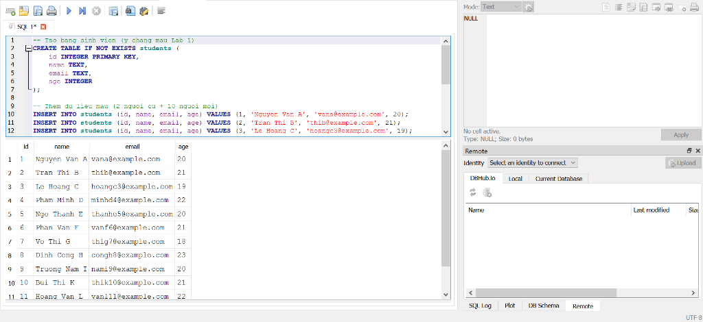
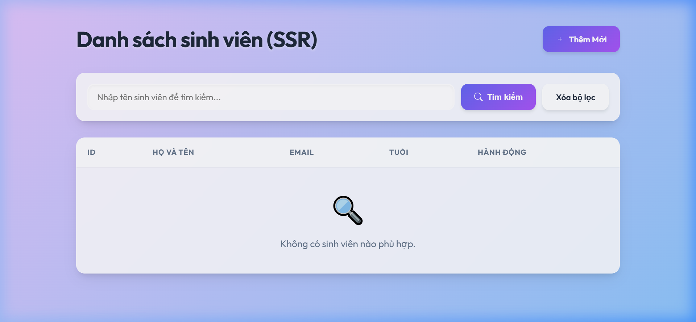
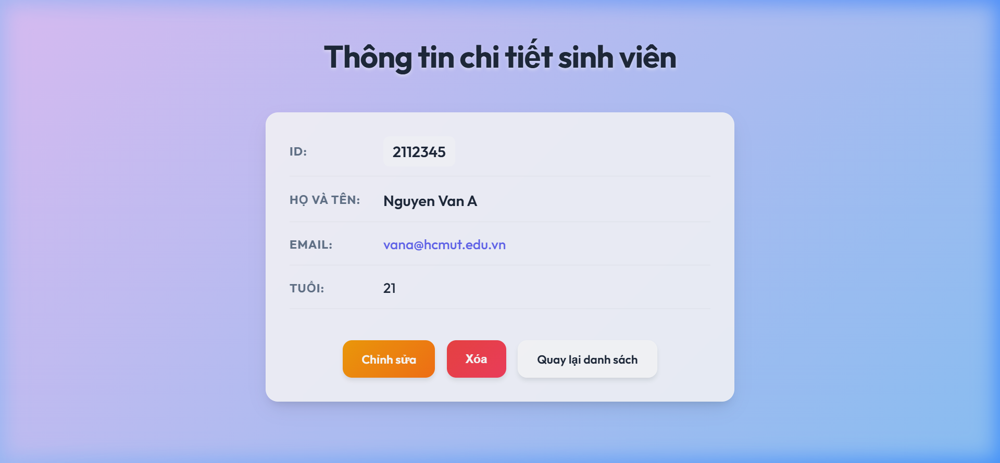
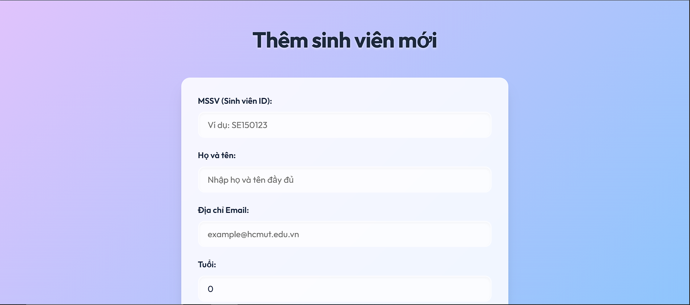
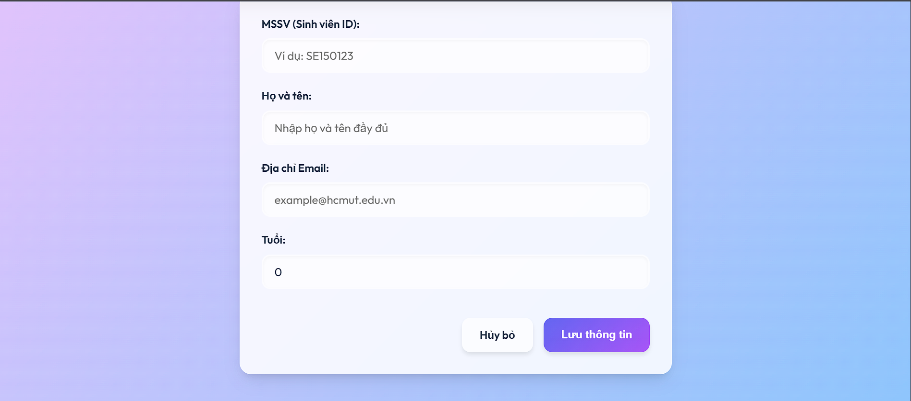
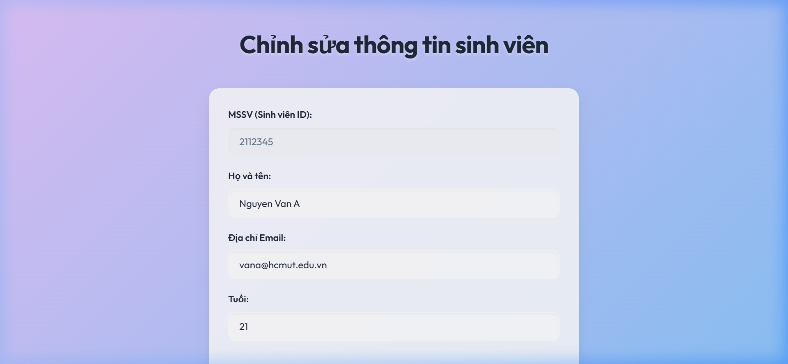

# Hệ Thống Quản Lý Sinh Viên (Student Management System)

Đây là dự án ứng dụng Web Quản Lý Sinh Viên cơ bản bằng Java Spring Boot, được xây dựng trong khuôn khổ chuỗi bài thực hành Lab 1-5. Dự án tích hợp các công nghệ như Spring Data JPA, Thymeleaf, giao diện Glassmorphism CSS hiện đại, và được Docker hóa để triển khai trên Render.com kết hợp PostgreSQL (Neon.tech).

## 👥 Danh sách nhóm
1. Trần Minh Quang - 2212757

---

## 🚀 Public URL (Web Service)
Ứng dụng đã được triển khai trực tiếp trên mạng Internet (Render.com + Neon.tech):
👉 **[https://studentmanagement-1-j7q2.onrender.com/students](https://studentmanagement-1-j7q2.onrender.com/students)**

---

## 💻 Hướng Dẫn Cách Chạy Dự Án (Local Development)

Để chạy dự án này trên máy tính cá nhân, yêu cầu hệ thống phải được cài đặt **Java 17**, **Maven**, và **PostgreSQL**.

### 1. Cấu hình Database
Tạo một schema/database trống trong PostgreSQL với tên tùy ý (ví dụ: `student_management`).
Tạo file `.env` tại thư mục gốc của dự án với nội dung cấu hình kết nối tới PostgreSQL cục bộ:
```env
POSTGRES_HOST=localhost
POSTGRES_PORT=5432
POSTGRES_DB=tên_database
POSTGRES_USER=tên_tài_khoản_postgres
POSTGRES_PASSWORD=mật_khẩu_postgres
```

### 2. Biên dịch và Chạy ứng dụng
Mở Terminal/Command Prompt tại gốc thư mục chứa code và chạy lệnh:
- **Biên dịch:** `mvn clean install -DskipTests` hoặc chạy tệp `mvnw.cmd` có sẵn.
- **Chạy Server:** `mvn spring-boot:run`
- Sau khi Server báo *Started StudentManagementApplication*, mở trình duyệt để truy cập ứng dụng tại địa chỉ: `http://localhost:8080/students`

---

## 📝 Trả Lời Các Câu Hỏi Lý Thuyết

### 1. Dữ liệu lớn


### 2. Ràng buộc Khóa Chính (Primary Key)
- **Thao tác:** Insert một sinh viên với ID = 1 (đã tồn tại).
- **Kết quả:** Hệ thống báo lỗi `UNIQUE constraint failed: students.id`.
- **Giải thích:** Database chặn thao tác này vì cột `id` được định nghĩa là PRIMARY KEY. Nguyên tắc cơ bản của CSDL quan hệ là khóa chính phải là duy nhất để định danh từng bản ghi, không được phép trùng lặp.

### 3. Toàn vẹn dữ liệu (Constraints)
- **Thao tác:** Insert một sinh viên với ID = 999 và name = NULL.
- **Kết quả:** Database CHO PHÉP (Success).
- **Giải thích:** Do lúc tạo bảng, cột `name` chưa được thiết lập ràng buộc NOT NULL.
- **Hậu quả khi code Java:** Đây là một rủi ro tiềm ẩn nghiêm trọng. Khi ứng dụng đọc bản ghi này lên, giá trị `student.getName()` sẽ là `null`. Nếu vòng lặp code không kiểm tra kỹ (ví dụ gọi hàm `student.getName().toUpperCase()`), chương trình sẽ bị Crash ngay lập tức với lỗi rò rỉ bộ nhớ `NullPointerException`. Điều này cho thấy tầm quan trọng của việc thiết lập ràng buộc chặt chẽ dữ liệu rác ngay từ tầng Database.

### 4. Cấu hình Hibernate
- **Giải thích:** Hiện tượng mất toàn bộ dữ liệu mỗi khi Server khởi động lại xuất phát từ tuỳ chọn cấu hình `spring.jpa.hibernate.ddl-auto=create` trong tệp `application.properties`. Giá trị `create` chỉ thị cho thư viện Spring Data JPA (Hibernate) thực thi lệnh xóa bỏ (DROP) toàn bộ các bảng đang tồn tại và tiến hành tạo mới (CREATE) lại cấu trúc bảng trống mỗi khi ứng dụng khởi chạy.
- **Giải pháp:** Trong môi trường triển khai thực tế (Production), cần thiết lập thuộc tính này thành `update` (chỉ cập nhật cấu trúc schema nếu Entity có sự thay đổi) hoặc `none` (vô hiệu hóa hoàn toàn cơ chế tự động can thiệp cấu trúc CSDL của Hibernate) nhằm đảm bảo an toàn và tránh rủi ro mất mát dữ liệu hệ thống.


---

## 📸 Ảnh Chụp Giao Diện Các Module (Lab 4 Screenshots)

**1. Màn hình Danh sách Sinh Viên (Read)**



**2. Màn hình Chi Tiết (Read Detail) & Xác nhận Xóa (Delete)** 


**3. Màn hình Thêm Mới / Chỉnh Sửa Form nhập liệu (Create & Update)**
- **Thêm Mới:**
  



- **Chỉnh Sửa:**


